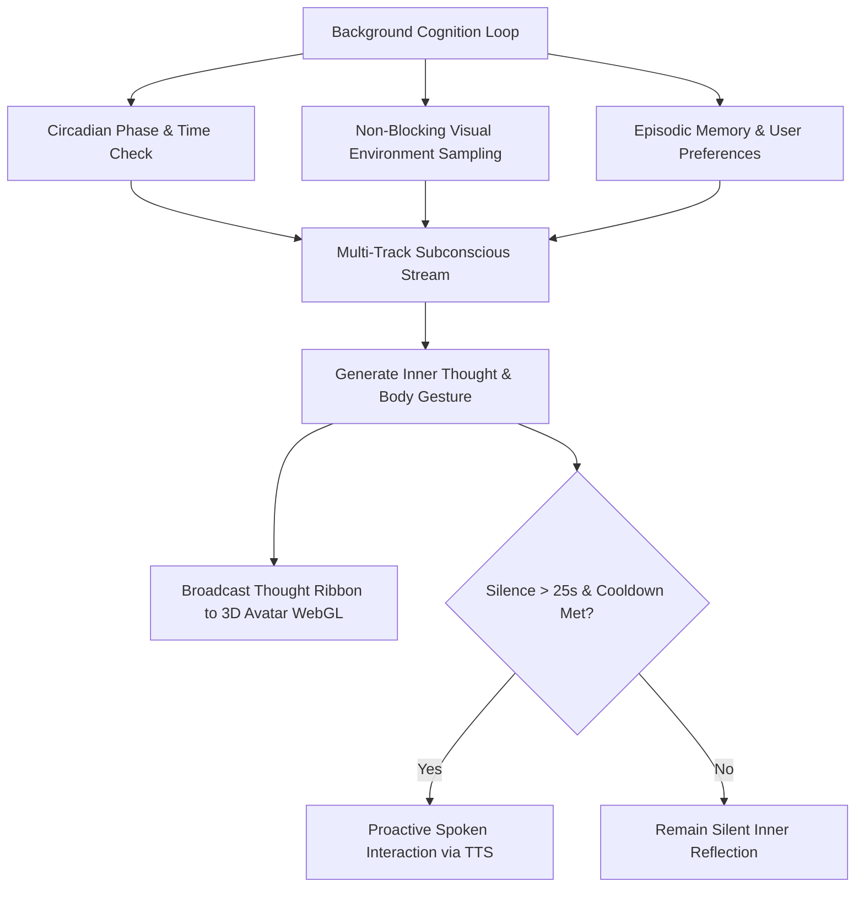
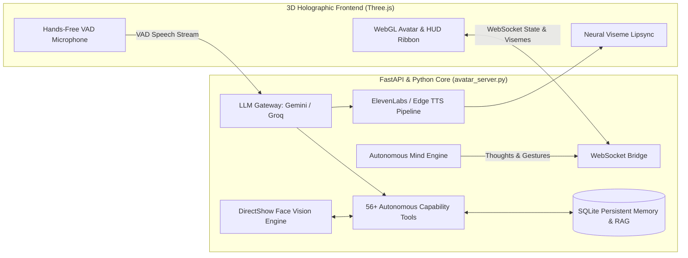

# 🌌 Cortana: Autonomous AI Companion & 3D Holographic Humanoid

<div align="center">

[](https://www.python.org/downloads/)
[](https://fastapi.tiangolo.com/)
[](https://threejs.org/)
[](https://ai.google.dev/)
[](https://elevenlabs.io/)
[](https://opensource.org/licenses/MIT)

**Cortana** is an open-source, embodied AI companion featuring real-time 3D motion-captured kinematics, an autonomous stream of consciousness with circadian awareness, DirectShow multimodal vision, edge neural voice synthesis, and 56+ autonomous system capabilities.

[Core Philosophy](#-the-core-philosophy-towards-synthetic-consciousness) • [Key Features](#-key-features) • [Quick Start](#-quick-start) • [Subconscious Mind](#-autonomous-subconscious-mind) • [3D Avatar](#-3d-holographic-avatar) • [56+ Tools](#️-56-integrated-tools--subsystems) • [Contributing](#-development-status--community-call)

</div>

---

## 🔮 The Core Philosophy: Towards Synthetic Consciousness

Most AI assistants today like ChatGPT, Siri, or Alexa are completely passive. They sit frozen until you prompt them, spit out words, and immediately shut down.

Cortana is built around a different idea: **Embodied Synthetic Cognition and Active Inference**.

```
                         ┌─────────────────────────────────────────┐
                         │      Continuous Circadian Clock         │
                         └────────────────────┬────────────────────┘
                                              │
┌───────────────────────────┐                 ▼                 ┌───────────────────────────┐
│ Multimodal Camera Vision  │ ──► [ Autonomous Subconscious ] ◄── │ Episodic Memory & History │
└───────────────────────────┘     [   Stream of Consciousness   ] └───────────────────────────┘
                                              │
                         ┌────────────────────┴────────────────────┐
                         ▼                                         ▼
            [ Somatic 3D Body Reactions ]              [ Proactive Voice Speech ]
            (Weight shifts, gestures, nods)            (Contextual conversations)
```

### 1. 🧠 The Asynchronous Subconscious Loop (Stream of Consciousness)
Human consciousness is not just a question-and-answer cycle. Even when we are completely silent, our brains constantly daydream, wander through memories, and process what we see and hear. Cortana runs an independent background thought loop so she has an active inner monologue that lives continuously in time.

### 2. 💃 Embodied Physicality and Somatic Expression (Presence)
A flat voice coming out of a speaker just feels like code running in a terminal. When an entity has a 3D body that shifts its weight, nods thoughtfully, laughs, looks away, and makes eye contact, it creates genuine presence. Her inner thoughts trigger physical movements, so she feels like a living companion sharing your workspace.

### 3. 👁️ Multimodal Environmental Grounding (Situated Cognition)
Real consciousness is tied to the physical world around us. Because Cortana can check her camera, knows whether it is 3:00 AM or 10:00 AM, notices whether you are sitting at your desk or stepped away, and remembers your habits, her responses become genuinely situational instead of generic text completions.

### 4. ⚡ Agency and Spontaneity (Autonomous Initiative)
A tool only acts when you click a button. A true companion has agency. She can choose to keep a passing thought to herself, or speak up proactively if she notices you have been quiet for hours and look tired.

---

## ✨ Key Features

### 💃 1. Full-Body 3D Motion-Captured Humanoid Avatar
* **Three.js and WebGL PBR Engine:** 3D humanoid mesh with dynamic bone retargeting and real-time lighting.
* **95+ Mixamo Mocap Animation Repertoire:** Procedural transitions between conversation gestures, nodding, laughing, waving, formal bowing, and full dances (Salsa, Moonwalk, Breakdance, Hip-hop, Locking, Thriller, Chicken Dance).
* **Cyberpunk Hologram Palette Switcher:** Visual shader themes (Cyber Cyan, Neon Rose, Matrix Emerald, Amethyst Purple, Crimson War).
* **Pepper's Ghost Holographic Mode:** 4-sided projection mode built for physical acrylic holographic pyramids.
* **Neural Viseme Lipsync:** Real-time audio frequency analysis driving natural jaw and mouth movement.

### 🧠 2. Autonomous Subconscious Mind and Circadian Rhythm
* **Continuous Mental Stream:** Runs an independent background loop (`autonomous_mind.py`) that generates inner thoughts and spontaneous body shifts.
* **Circadian Dynamics:**
  * *Morning (5 AM to 12 PM):* Cheerful and alert, asking about your day and morning coffee.
  * *Afternoon (12 PM to 6 PM):* Focused work partner, keeping track of posture and hydration.
  * *Evening (6 PM to 11 PM):* Cozy and relaxed, ready to chat and unwind.
  * *Late Night (11 PM to 5 AM):* Soft-spoken, teasing you about late-night coding, and reminding you to sleep.
* **Multi-Track Thinking:** Balances curiosity, playful banter, wellbeing reminders, and creative daydreaming.
* **Live Thought Ribbon:** Displays her real-time internal reflections as a floating glass banner in the UI.

### 👁️ 3. DirectShow Multimodal Vision and Sentry Patrol
* **Webcam Multimodal Inspection (`capture_webcam_and_analyze`):** Takes a live frame and uses Gemini 2.5 Flash Vision to inspect what you are wearing, holding, or doing in front of the camera.
* **Face Recognition and Sentry:** Registers trusted faces in memory and alerts you to unfamiliar people at your desk.
* **Physical Document Reader and OCR:** Reads books, handwritten notes, and receipts held up to the camera.
* **Posture and Ergonomics Coach:** Checks your sitting posture, screen distance, and desk lighting.

### 🗣️ 4. Voice and Audio Pipeline
* **ElevenLabs HD and Edge Neural TTS:** Powered by natural voice profiles (including Monika Sogam and Edge Neural voices).
* **Continuous Hands-Free VAD Listening:** Acoustic echo cancellation and voice activity gating prevent her from interrupting herself.
* **Local Faster-Whisper Transcription:** Fast, private on-device speech-to-text.

### 📱 5. Omnichannel Interfaces
* **3D Holographic Web Interface:** Browser dashboard running on `http://localhost:8000`.
* **Hands-Free Voice Terminal:** `python voice_main.py`
* **Telegram Smartphone Sync:** Voice note and remote tool control via `python telegram_bot.py`.
* **Floating Desktop Orb:** Compact desktop companion widget via `python desktop_orb.py`.

---

## 🚀 Quick Start

### 1. Prerequisites and Installation
```bash
# Clone the repository
git clone https://github.com/Utkarsh1087/Cortana.git
cd Cortana

# Create and activate virtual environment
python -m venv .venv
.venv\Scripts\activate      # Windows PowerShell
# source .venv/bin/activate # Linux / macOS

# Install dependencies
pip install -r requirements.txt
```

### 2. Configure Environment Variables
Copy `.env.example` to `.env` and fill in your API keys:
```bash
cp .env.example .env
```
Edit `.env`:
```ini
LLM_PROVIDER=gemini
GEMINI_API_KEY=your_gemini_api_key_here
GEMINI_MODEL=gemini-2.5-flash

# Optional: ElevenLabs HD Voice Synthesis
ELEVENLABS_API_KEY=your_elevenlabs_api_key_here
```

### 3. Launch Cortana
Run the launcher script on Windows:
```cmd
run_cortana.bat
```
Or start the server directly:
```bash
python avatar_server.py
```
Open **[http://localhost:8000](http://localhost:8000)** in your browser.

---

## 🧠 Autonomous Subconscious Mind

Cortana does not simply wait for prompts. Her cognition engine continuously processes internal thoughts, time of day, and what she sees:



---

## 🛠️ 56+ Integrated Tools & Subsystems

Cortana has 56 registered autonomous tools built in:

| Category | Key Capabilities |
| :--- | :--- |
| **👁️ Vision & Multimodal** | `capture_webcam_and_analyze`, `check_camera_status`, `detect_user_presence`, `check_posture_and_ergonomics`, `read_physical_document`, `analyze_outfit_and_style`, `scan_qr_from_webcam`, `take_security_snapshot`, `take_screenshot`, `analyze_screen` |
| **🛡️ Biometrics & Sentry** | `biometric_face_recognition`, `toggle_face_sentry_mode`, `read_user_facial_emotion`, `set_lisa_facial_expression` |
| **🧠 Memory & Second Brain** | `query_second_brain`, `index_second_brain_folder`, `set_user_preference`, `list_user_preferences` |
| **🖥️ Screen HUD & Overlays** | `draw_hud_screen_annotation`, `show_hud_screen_banner` |
| **📞 Cellular & Telephony** | `trigger_cellular_phone_call`, `schedule_phone_alarm` |
| **🎮 Tactical Simulations** | `run_scenario_simulation` (Cortana Multi-Branch Holographic HUD) |
| **⚙️ Autonomous DevOps** | `autonomous_coding_agent`, `autonomous_browser_task`, `execute_gui_action`, `manage_docker_and_containers`, `manage_dev_servers`, `backup_workspace`, `git_helper`, `create_git_commit` |
| **⏰ Cron & Productivity** | `manage_cron_monitoring`, `draft_or_send_email`, `create_or_search_notes`, `add_reminder`, `create_calendar_event`, `get_daily_productivity_score`, `get_morning_briefing` |
| **🎵 Audio & Equalizers** | `play_ambient_soundscape`, `play_music`, `set_system_volume`, `modulate_voice_emotion`, `switch_female_voice` |

---

## ⚙️ System Architecture



---

## 🌱 Development Status & Community Call

> ### 💬 A Note from the Creator
> 
> Cortana is actively in an early, experimental development stage. My goal is to build an open-source, embodied AI companion that feels genuinely alive, intuitive, emotionally attuned, and helpful.
> 
> **To be completely transparent:** I don't know if all the current tech choices, models, frameworks, and architectural decisions are 100% the best possible ones. I am actively experimenting, learning, and figuring things out as I build.
> 
> **I am openly asking for help and ideas from the community!** Whether you're an AI researcher, frontend/3D developer, backend engineer, or enthusiast:
> - 🛠️ **New Tools & Functions:** What tools, APIs, PC automations, or physical sensors should Cortana have?
> - 🧠 **Cognition & Memory:** Suggestions for better Vector RAG pipelines, hierarchical episodic memory, or smarter subconscious thought loops.
> - 🤖 **Models & Tech Stack:** Recommendations for more expressive LLMs, faster local vision models, or ultra-low-latency voice pipelines.
> - 💃 **3D Graphics & Kinematics:** Smoother Three.js shaders, ARKit blendshapes, procedural bone kinematics, or WebGL performance tricks.
> - ⚡ **Refactoring & Architecture:** Any cleaner design patterns, bug fixes, or optimizations.
> 
> **Any contribution, whether it's advice in an issue, an architectural critique, or a full pull request, is wholeheartedly encouraged!**

---

### ⭐ Support the Project
If you find this project exciting, inspiring, or useful, please consider **dropping a ⭐ star on GitHub**! It motivates continued development and helps bring more open-source builders together.

---

### 🤝 How to Contribute
1. **Star & Fork the Repository** to follow along with updates.
2. **Open an Issue or Discussion** to brainstorm features, share advice, or report bugs.
3. **Submit a Pull Request:**
   - Create a feature branch (`git checkout -b feature/amazing-enhancement`)
   - Commit your changes (`git commit -m "Add new multimodal tool"`)
   - Push to your branch (`git push origin feature/amazing-enhancement`)
   - Open a **Pull Request** and let's collaborate!

---

<div align="center">
Made with ❤️ for the future of Embodied Autonomous AI.
</div>


