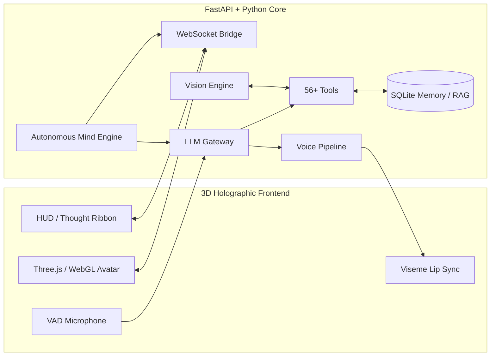
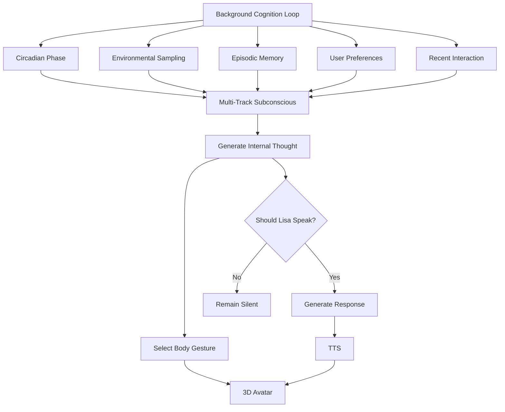

# 🌌 Lisa: Autonomous AI Companion & 3D Holographic Humanoid

<div align="center">

[](https://www.python.org/downloads/)
[](https://fastapi.tiangolo.com/)
[](https://threejs.org/)
[](https://ai.google.dev/)
[
[](https://opensource.org/licenses/MIT)

### **What if an AI didn't just wait for you to talk to it — but actually existed alongside you?**

**Lisa** is an open-source experiment toward building an **embodied, autonomous AI companion** that can see, listen, remember, think continuously, speak proactively, and express itself through a 3D humanoid body.

[🌌 Vision](#-the-vision) •
[✨ Features](#-key-features) •
[🧠 Cognition](#-autonomous-subconscious-mind) •
[🏗️ Architecture](#️-system-architecture) •
[🗺️ Roadmap](#️-roadmap) •
[🤝 Contribute](#-help-build-lisa)

</div>

---

# 🌌 The Vision

Most AI assistants today follow a simple loop:

```text
You → Prompt → AI → Response → Silence
```

Lisa explores a different model:

```text
                  ┌─────────────────────┐
                  │   Continuous Time   │
                  └──────────┬──────────┘
                             ↓
┌──────────────┐      ┌──────────────┐      ┌──────────────┐
│    Vision    │ ───► │     Lisa     │ ◄─── │    Memory    │
└──────────────┘      │              │      └──────────────┘
                      │ Thinks       │
                      │ Remembers    │
                      │ Reasons      │
                      │ Acts         │
                      │ Expresses    │
                      └──────┬───────┘
                             ↓
                ┌────────────────────────┐
                │ Voice + 3D Expression  │
                └────────────────────────┘
```

The goal is not simply to build another chatbot.

The experiment is to explore:

> **What happens when AI becomes persistent, embodied, situationally aware and capable of taking initiative?**

Lisa is an early-stage project, and many parts of the architecture are still experimental. The project is intentionally open to better ideas, models, research and implementations.

---

# 🧠 Core Philosophy

Lisa is built around four ideas.

### 1. 🧠 Continuous Cognition

Human interaction isn't purely question → answer.

Even when we're not talking, our minds continue processing memories, observations, plans and ideas.

Lisa therefore has an independent background cognition loop that can continue processing without waiting for a user prompt.

---

### 2. 💃 Embodied Physicality

A voice coming from a computer feels different from an entity that can:

* Look toward you
* Nod
* Shift its weight
* Laugh
* Wave
* Change facial expressions
* React while speaking
* Move naturally during conversation

Lisa's internal state can influence her physical expression through a 3D humanoid avatar.

---

### 3. 👁️ Situated Awareness

An AI becomes more useful when it understands the context around it.

Lisa can potentially combine:

* Camera observations
* Screen context
* Time of day
* User presence
* Conversation history
* Persistent memory
* Environmental information

Instead of only asking:

> "What did the user say?"

Lisa can reason about:

> **"What is happening around the user right now?"**

---

### 4. ⚡ Agency & Spontaneity

A conventional tool waits for an instruction.

Lisa explores the possibility of an AI that can decide:

> "This is worth mentioning."

or:

> "I'll keep this thought to myself."

This means proactive interaction is treated as a **decision**, rather than simply making the AI talk constantly.

---

# ✨ Key Features

## 💃 1. Full-Body 3D Humanoid Avatar

Built using **Three.js and WebGL**.

* Real-time 3D humanoid rendering
* Dynamic bone retargeting
* 95+ Mixamo motion-captured animations
* Procedural animation transitions
* Conversation gestures
* Nodding
* Laughing
* Waving
* Formal bowing
* Dance animations
* Salsa
* Moonwalk
* Breakdance
* Hip-hop
* Locking
* Thriller
* Chicken Dance
* Dynamic facial expressions
* Cyberpunk holographic themes
* Neural viseme-based lip synchronization

### Holographic Mode

Lisa also supports a **Pepper's Ghost-style holographic display**, designed around physical acrylic holographic pyramids.

---

# 🧠 2. Autonomous Subconscious Mind

Lisa doesn't have to remain completely idle when the user isn't talking.

The autonomous cognition engine continuously evaluates:

* Current time
* Circadian phase
* User presence
* Recent conversation
* Memories
* Environment
* Internal state
* Previous thoughts

This produces a continuous stream of internal processing.

### Example

```text
User stops talking
        ↓
Lisa observes environment
        ↓
Checks time + context
        ↓
Retrieves relevant memories
        ↓
Generates internal thought
        ↓
Decides whether to remain silent
        ↓
Updates physical expression
        ↓
Optionally speaks proactively
```

The important distinction is:

> **Thinking does not necessarily mean speaking.**

Lisa can have an internal state without constantly interrupting the user.

---

# 🌅 3. Circadian Awareness

Lisa's behavior can change depending on the time of day.

### Morning — 5 AM → 12 PM

* More energetic
* Cheerful
* Morning-oriented interactions

### Afternoon — 12 PM → 6 PM

* Work-focused
* Productivity-oriented
* Contextual reminders

### Evening — 6 PM → 11 PM

* More relaxed
* Conversational
* Creative / casual interactions

### Late Night — 11 PM → 5 AM

* Lower-energy voice
* Context-aware interactions
* Awareness that the user may be working late

---

# 👁️ 4. Multimodal Vision

Lisa can interact with the physical environment through the webcam.

### Vision capabilities include:

* Live webcam inspection
* Object/environment analysis
* User presence detection
* Document reading
* OCR
* Outfit analysis
* QR scanning
* Screenshot analysis
* Screen understanding
* Posture analysis
* Ergonomic analysis

### Example

A user can hold a document in front of the camera and Lisa can analyze it without requiring the user to manually upload the image.

---

# 🛡️ 5. Face Recognition & Sentry

Lisa includes experimental environmental security capabilities.

* Trusted-face registration
* Face recognition
* User presence detection
* Unknown-person alerts
* Security snapshots
* Facial-expression analysis

These capabilities are intended to remain configurable and privacy-conscious.

---

# 🗣️ 6. Voice & Audio Pipeline

Lisa supports a complete voice interaction pipeline.

### Speech-to-Text

* Local Faster-Whisper transcription
* Hands-free listening
* Voice Activity Detection
* Acoustic echo handling

### Text-to-Speech

* ElevenLabs HD voices
* Edge Neural TTS
* Voice switching
* Voice emotion modulation

### Interaction

```text
Microphone
    ↓
Voice Activity Detection
    ↓
Speech-to-Text
    ↓
LLM / Cognitive Engine
    ↓
Tool Selection / Reasoning
    ↓
Text Response
    ↓
Text-to-Speech
    ↓
Audio Output
    ↓
3D Viseme / Body Animation
```

---

# 📱 7. Multiple Interfaces

Lisa is not limited to a single interface.

### 🌐 Web

3D holographic dashboard:

```text
http://localhost:8000
```

### 🎙️ Voice Terminal

```bash
python voice_main.py
```

### 📱 Telegram

Remote interaction and tool control through Telegram.

```bash
python telegram_bot.py
```

### 🖥️ Desktop Orb

A compact floating desktop companion:

```bash
python desktop_orb.py
```

---

# 🛠️ 56+ Integrated Tools & Subsystems

Lisa currently contains 56+ registered tools and subsystems.

| Category                      | Capabilities                                                                                                                                                                                                                                            |
| ----------------------------- | ------------------------------------------------------------------------------------------------------------------------------------------------------------------------------------------------------------------------------------------------------- |
| 👁️ **Vision & Multimodal**   | `capture_webcam_and_analyze`, `check_camera_status`, `detect_user_presence`, `check_posture_and_ergonomics`, `read_physical_document`, `analyze_outfit_and_style`, `scan_qr_from_webcam`, `take_security_snapshot`, `take_screenshot`, `analyze_screen` |
| 🛡️ **Biometrics & Sentry**   | `biometric_face_recognition`, `toggle_face_sentry_mode`, `read_user_facial_emotion`, `set_lisa_facial_expression`                                                                                                                                       |
| 🧠 **Memory & Second Brain**  | `query_second_brain`, `index_second_brain_folder`, `set_user_preference`, `list_user_preferences`                                                                                                                                                       |
| 🖥️ **Screen HUD & Overlays** | `draw_hud_screen_annotation`, `show_hud_screen_banner`                                                                                                                                                                                                  |
| 📞 **Cellular & Telephony**   | `trigger_cellular_phone_call`, `schedule_phone_alarm`                                                                                                                                                                                                   |
| 🎮 **Simulations**            | `run_scenario_simulation`                                                                                                                                                                                                                               |
| ⚙️ **Autonomous Systems**     | `autonomous_coding_agent`, `autonomous_browser_task`, `execute_gui_action`, `manage_docker_and_containers`, `manage_dev_servers`, `backup_workspace`, `git_helper`, `create_git_commit`                                                                 |
| ⏰ **Productivity**            | `manage_cron_monitoring`, `draft_or_send_email`, `create_or_search_notes`, `add_reminder`, `create_calendar_event`, `get_daily_productivity_score`, `get_morning_briefing`                                                                              |
| 🎵 **Audio**                  | `play_ambient_soundscape`, `play_music`, `set_system_volume`, `modulate_voice_emotion`, `switch_female_voice`                                                                                                                                           |

---

# 🏗️ System Architecture



---

# 🧠 Autonomous Subconscious Architecture



---

# 🚀 Quick Start

## 1. Clone the repository

```bash
git clone https://github.com/Utkarsh1087/Cortana.git
cd Cortana
```

## 2. Create a virtual environment

### Windows

```bash
python -m venv .venv
.venv\Scripts\activate
```

### Linux / macOS

```bash
python -m venv .venv
source .venv/bin/activate
```

## 3. Install dependencies

```bash
pip install -r requirements.txt
```

## 4. Configure environment variables

Copy the example environment file:

```bash
cp .env.example .env
```

Configure your API keys:

```ini
LLM_PROVIDER=gemini

GEMINI_API_KEY=your_gemini_api_key_here
GEMINI_MODEL=gemini-2.5-flash

# Optional
ELEVENLABS_API_KEY=your_elevenlabs_api_key_here
```

## 5. Launch Lisa

### Windows

```cmd
run_cortana.bat
```

### Or directly

```bash
python avatar_server.py
```

Then open:

```text
http://localhost:8000
```

---

# 🗺️ Roadmap

Lisa is intentionally experimental.

The roadmap will evolve as better architectures, models and ideas emerge.

## Phase 1 — Foundation

* [x] 3D humanoid avatar
* [x] Voice interaction
* [x] Multimodal vision
* [x] Persistent memory
* [x] Autonomous background cognition
* [x] Tool system
* [x] Desktop interface
* [x] Telegram interface
* [x] Holographic display mode

---

## Phase 2 — Make Lisa Feel More Alive

* [ ] More natural conversational turn-taking
* [ ] Better facial expressions
* [ ] Improved eye contact
* [ ] Emotion-aware voice
* [ ] Context-aware gestures
* [ ] More natural idle animations
* [ ] Better interruption handling
* [ ] Improved autonomous thought coherence
* [ ] Better memory formation

---

## Phase 3 — Better Autonomy

* [ ] Long-horizon planning
* [ ] Goal management
* [ ] Self-evaluation
* [ ] Improved tool selection
* [ ] Background task execution
* [ ] Better computer interaction
* [ ] More reliable autonomous workflows

---

## Phase 4 — Local & Private AI

* [ ] Local LLM support
* [ ] Local vision models
* [ ] Local STT/TTS
* [ ] Local vector database
* [ ] Reduced cloud dependency
* [ ] Privacy-first configuration
* [ ] Offline-capable mode

---

## Phase 5 — Physical Embodiment

* [ ] Hardware sensors
* [ ] External displays
* [ ] Environmental sensors
* [ ] Physical device integrations
* [ ] Robotics experiments
* [ ] Actuator control
* [ ] Expanded holographic interfaces

---

# 🤝 Help Build Lisa

## **I don't have all the answers. That's the point.**

Lisa is currently an early-stage experiment.

I'm building the project and experimenting with different technologies, but I don't believe the current architecture, models or implementation are necessarily the best possible solutions.

**I want other people to challenge it.**

If you are interested in AI agents, cognitive architectures, voice systems, computer vision, 3D graphics, robotics, automation or human-computer interaction, I'd genuinely love your ideas.

---

## 🧩 What You Can Contribute

You don't need to understand the entire codebase.

You can contribute to one small part of the system.

### 🧠 AI / Cognitive Architecture

Ideas and implementations around:

* Long-term memory
* Episodic memory
* Hierarchical memory
* RAG
* Planning
* Reasoning
* Agent architectures
* Autonomous thought loops
* Personality systems
* Context management
* Goal management

---

### 👁️ Computer Vision

Help improve:

* Real-time vision
* Object detection
* Activity recognition
* Pose estimation
* Face recognition
* Environmental awareness
* Gesture recognition
* Local vision models

---

### 🗣️ Voice AI

Help experiment with:

* Lower-latency STT
* Lower-latency TTS
* Local voice models
* Voice emotion
* Natural interruptions
* Turn-taking
* Wake-word systems
* Real-time conversational audio

---

### 💃 3D / Animation

If you're into Three.js, WebGL, Blender or animation:

* Better avatar animations
* Procedural gestures
* Facial expressions
* Eye movement
* Lip-sync
* Blendshapes
* Bone kinematics
* Shader improvements
* WebGL performance

---

### ⚙️ Backend / Systems

Help with:

* Architecture
* Performance
* Async processing
* Event-driven systems
* WebSockets
* Tool orchestration
* Memory infrastructure
* Local-first architecture
* Reliability

---

### 🛠️ New Capabilities

Have an idea for something Lisa should be able to do?

It could be:

* A new AI capability
* A PC automation
* A new API integration
* A physical sensor
* A hardware interface
* A productivity workflow
* A completely new interaction model

**Open an issue and propose it.**

---

# 💡 You Don't Have to Write Code

Contribution doesn't necessarily mean submitting a pull request.

You can help by:

* 💬 Opening an issue with an idea
* 🧠 Suggesting a better architecture
* 📚 Sharing research papers
* 🔬 Testing different models
* 🐛 Reporting bugs
* 🧪 Testing Lisa on another machine
* 📖 Improving documentation
* 🎨 Creating animations
* 🧩 Building integrations
* ⚡ Optimizing existing code
* 🔍 Reviewing architectural decisions
* 🔀 Submitting a pull request

Even a comment saying:

> **"I think this part could be implemented using X because..."**

can be valuable.

---

# 🌱 Community Ideas

The roadmap is **not fixed**.

If you have an idea that could make this concept more realistic, useful or interesting, open an issue.

Some questions I'm particularly interested in:

### 🧠 Cognition

> How should a continuously-running AI decide what is worth thinking about?

### 🗂️ Memory

> What would a genuinely useful long-term memory architecture look like?

### ⚡ Agency

> How should Lisa decide when to proactively interact with the user?

### 👁️ Awareness

> How much environmental context should an AI actually process?

### 💃 Embodiment

> What makes a digital character feel physically present rather than simply animated?

### 🏠 Physical World

> What sensors, hardware or robotics could make Lisa genuinely embodied?

### 🔒 Privacy

> Can we build a companion that is increasingly capable while keeping sensitive processing local?

---

# 🐛 Current Status

Lisa is **experimental software**.

Some features may be unstable, incomplete, highly dependent on specific hardware, or subject to change.

The project is primarily an exploration of:

```text
AI Agents
     +
Memory
     +
Vision
     +
Voice
     +
Autonomy
     +
3D Embodiment
     +
Physical / Digital Environment
```

The goal is to learn what actually works.

---

# 🔐 Privacy & Safety

Because Lisa can interact with cameras, microphones, files, screens and system tools, these capabilities should be treated carefully.

Before enabling sensitive capabilities:

* Review the permissions
* Understand what data is being processed
* Use local models where appropriate
* Avoid exposing API keys
* Do not run untrusted tools blindly
* Configure autonomous actions carefully

The project is intended as an experimental open-source system, not as a replacement for security software or professional safety systems.

---

# ⭐ Support the Project

If you find the idea interesting, there are several ways to help.

### ⭐ Star the repository

A star helps other developers discover the project.

### 🔀 Fork it

Experiment with your own implementation.

### 💬 Start a discussion

Challenge an architectural decision or propose a completely different approach.

### 🐛 Open an issue

Found a bug or have an idea?

Open an issue.

### 🤝 Contribute

If you want to build something, submit a pull request.

---

# 🚀 The Bigger Question

Lisa is not meant to be the final answer to what an autonomous AI companion should look like.

It's an experiment.

A starting point.

The interesting question is:

> **Can we build AI systems that don't merely respond to us, but continuously exist, perceive, remember, express themselves and participate in the world around us?**

I don't know the answer yet.

**That's what I'm trying to find out.**

If you have ideas, expertise, criticism or code that could help explore that question:

## **Build with me.**

---

# 🤝 Contributing

1. ⭐ **Star & fork the repository**
2. 💬 **Open an issue or discussion**
3. 🧩 **Pick an existing issue**
4. 🌱 **Create a feature branch**

```bash
git checkout -b feature/amazing-enhancement
```

5. 💻 **Make your changes**
6. 🧪 **Test them locally**
7. 📝 **Commit your changes**

```bash
git commit -m "Add new multimodal capability"
```

8. 🚀 **Push your branch**

```bash
git push origin feature/amazing-enhancement
```

9. 🔀 **Open a Pull Request**

Please explain:

* What you changed
* Why you changed it
* How you tested it
* Any limitations or future improvements

---

# 📄 License

This project is licensed under the **MIT License**.

---

<div align="center">

### 🌌 Built as an experiment in Embodied Autonomous AI.

**If you believe AI companions could become something fundamentally different from today's chatbots, come build it with me.**

Made with ❤️ for the future of human-AI interaction.

</div>
