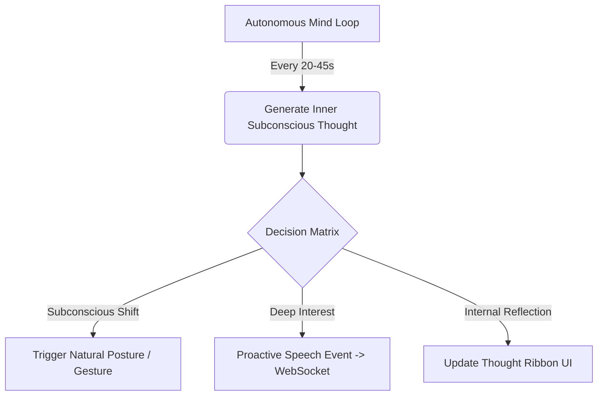

# 🌟 Lisa — Autonomous AI Companion & 3D Holographic Humanoid

<div align="center">


[](https://www.python.org/downloads/)
[](https://fastapi.tiangolo.com/)
[](https://threejs.org/)
[](https://opensource.org/licenses/MIT)

**Lisa** is an open-source, embodied, multimodal AI companion featuring real-time 3D motion-captured kinematics, an autonomous stream of consciousness, multimodal vision, edge voice synthesis, and 56+ autonomous system tools.

[✨ Key Features](#-key-features) • [🚀 Quick Start](#-quick-start) • [🧠 Autonomous Mind](#-autonomous-mind--stream-of-consciousness) • [💃 3D Avatar & Mocap](#-3d-avatar--mocap-engine) • [🛠️ 56+ Tool Suite](#️-56-integrated-tools) • [⚙️ Architecture](#-system-architecture)

</div>

---

## ✨ Key Features

- 💃 **Full-Body 3D Motion-Captured Humanoid Avatar**:
  - Built with **Three.js** and **FBXLoader** with dynamic bone retargeting.
  - Library of **95+ Mixamo mocap animations** (Salsa dancing, Moonwalk, Breakdancing, Hip-hop, Laughing, Waving, Crying, and emotive body language).
  - Dynamic **Hologram Palette Switcher** (Cyber Cyan, Neon Rose, Matrix Emerald, Amethyst Purple, Crimson War).
  - **Pepper's Ghost Mode**: 4-sided projection pyramid rendering for physical holographic displays.

- 🧠 **Autonomous Cognition & Stream of Consciousness**:
  - Independent background mental loop (`autonomous_mind.py`).
  - Spontaneous thoughts, natural posture shifts, and proactive conversation generation without requiring user prompts.
  - Live **Pulsing Thought Ribbon** showing real-time internal reflections.

- 🗣️ **Lifelike Voice & Audio Pipeline**:
  - Ultra-fast Neural Speech Synthesis using **Microsoft Edge TTS** (`Jenny`, `Aria`, `Sonia`, `Natasha`, `Neerja`) and **ElevenLabs**.
  - Local speech-to-text with **Faster-Whisper** and open-source wake-word activation.
  - Real-time 3D speech visualizer and audio equalizers.

- 🌐 **Multi-Provider LLM Gateway**:
  - Native support for **Google Gemini** (Gemini 2.5 / 1.5 Flash), **Groq** (Llama 3.3 70B), **Ollama** (100% local/offline), and **OpenRouter**.
  - Automatic `[EMOTION: ...]` and `[ANIMATION: ...]` tagging with conversational fallback and learning behaviors.

- 🛠️ **56+ Integrated Tools & Subsystems**:
  - Local RAG Second Brain vector search, Face Vision Sentry, Floating Screen HUD Annotations, Cellular Twilio Calling, Tactical Scenario Simulations, DevOps Container Tools, and Screen/Webcam Multimodal Analysis.

- 📱 **Omnichannel Interfaces**:
  - 3D Web Avatar (`http://localhost:8000`).
  - Voice Interaction Loop (`voice_main.py`).
  - Telegram Bot Gateway (`telegram_bot.py`).
  - Translucent Floating Desktop Orb (`desktop_orb.py`).

---

## 🚀 Quick Start

### 1. Clone the Repository
```bash
git clone https://github.com/yourusername/lisa.git
cd lisa
```

### 2. Set Up Virtual Environment & Dependencies
```bash
# Create and activate virtual environment
python -m venv .venv

# Windows
.venv\Scripts\activate

# Linux / macOS
source .venv/bin/activate

# Install dependencies
pip install -r requirements.txt
```

### 3. Configure Environment Variables
Copy `.env.example` to `.env` and configure your preferred LLM provider:
```bash
cp .env.example .env
```
Edit `.env` with your API key:
```ini
LLM_PROVIDER=gemini
GEMINI_API_KEY=your_gemini_api_key_here
GEMINI_MODEL=gemini-2.5-flash
```

### 4. Launch Lisa 3D Avatar
```bash
python avatar_server.py
```
Open **[http://localhost:8000](http://localhost:8000)** in your browser to interact with Lisa!

---

## 🧠 Autonomous Mind & Stream of Consciousness

Lisa doesn't just passively wait for commands — she possesses an autonomous mental engine:



- **Always-On Consciousness**: Lisa continuously thinks in the background, evolving her thoughts and body language naturally.
- **Thought Ribbon**: Observe what Lisa is thinking in real time at the top of the interface.

---

## 💃 3D Avatar & Mocap Engine

Lisa's physical body supports natural conversational gestures and full-body dance choreography:

| Category | Available Animations |
|---|---|
| **Dances** | Salsa Dancing, Moonwalk, Breakdance (1990, Freezes, Swipes, Uprock), Hip-Hop, Locking, Tutting, Thriller, Chicken Dance, Swing |
| **Conversational** | Waving, Quick Bow, Clapping, Laughing, Relieved Sigh, Thoughtful Head Shake, Lengthy Head Nod, Sarcastic Nod |
| **Emotive** | Excited, Angry Point, Yelling, Arguing, Looking Away, Dismissing Gesture, Disappointed, Rejected, Cocky |
| **Idles** | Relaxed Weight Shift, Happy Idle, Sad Idle, Tactile Float |

> **Flirty Learning Rule**: If you ask Lisa to perform an animation not currently in her library (e.g., *backflip* or *tango*), she will playfully let you know and ask you to teach her!

---

## 🛠️ 56+ Integrated Tools

```
Lisa Ecosystem
├── Autonomous DevOps & Coding    (autonomous_coding_agent, execute_gui_action, backup_workspace)
├── Vision & Sentry Patrol       (biometric_face_recognition, check_posture, screen_analysis)
├── Knowledge & Local RAG        (query_second_brain, index_second_brain_folder, summarize_web)
├── Screen HUD & Floating Orb     (draw_hud_screen_annotation, show_hud_screen_banner)
├── Cellular Telephony            (trigger_cellular_phone_call, schedule_phone_alarm)
├── Ambient Soundscapes          (spaceship_cabin, cyberpunk_rain, deep_space, fireplace)
└── Tactical Simulation          (run_scenario_simulation)
```

---

## ⚙️ System Architecture

```
├── avatar/                     # 3D Holographic Frontend
│   ├── index.html              # Modern glassmorphism UI & Three.js canvas
│   ├── avatar.js               # Kinematics, bone retargeting & animation mixer
│   ├── style.css               # Cyberpunk & holographic styling
│   └── models/                 # 3D Humanoid Mesh & 95 Mixamo Mocap FBX Files
├── autonomous_mind.py          # Autonomous Cognition & Proactive Stream of Consciousness
├── avatar_server.py            # FastAPI + WebSocket Server for 3D Client
├── config.py                   # System prompt, emotion parser & multi-LLM configuration
├── llm.py                      # Multi-provider LLM gateway (Gemini, Groq, Ollama, OpenRouter)
├── tts.py                      # Neural text-to-speech engine (Edge-TTS & ElevenLabs)
├── stt.py                      # Faster-Whisper audio transcription
├── memory.py                   # Persistent SQLite conversation & emotional memory
├── tools.py                    # 56+ tool definitions & execution engine
├── rag_engine.py               # Local vector search second brain
├── desktop_orb.py              # Floating translucent desktop widget
├── telegram_bot.py             # Telegram gateway
└── requirements.txt            # Python dependencies
```

---

## 📜 License

Distributed under the MIT License. See `LICENSE` for more information.

---

<div align="center">
Made with ❤️ for the future of Embodied Autonomous AI.
</div>
